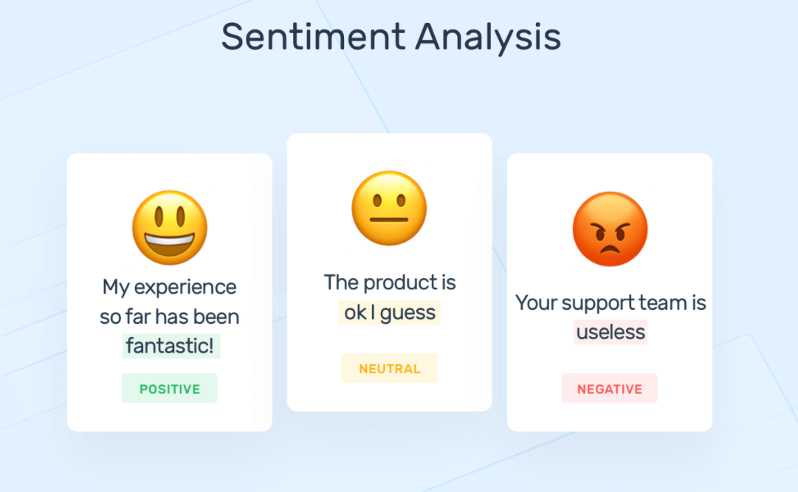

# Sentiment Analysis on Amazon Reviews
**Sentiment analysis**, a branch of Natural Language Processing (NLP), automates the extraction of sentiment or opinion from text data. By analyzing sentiments expressed in product reviews, businesses can gain valuable insights into consumer preferences and trends. This project focuses specifically on sentiment analysis for product reviews sourced from Amazon's electronics category. Electronics represent a dynamic and popular category on Amazon, making it crucial for businesses to understand consumer sentiments within this domain.

## Introduction
In the expanding realm of e-commerce, platforms like Amazon have transformed the consumer experience, providing unparalleled access to a vast array of products. However, this abundance of choice presents challenges for both consumers and businesses. The surge in product reviews on platforms like Amazon has created a wealth of feedback for consumers to navigate. Yet, for businesses, the challenge lies in extracting meaningful insights from this massive volume of unstructured data.

## Project Description
In the rapidly evolving landscape of e-commerce, businesses face the challenge of harnessing the wealth of customer sentiments embedded within online reviews to drive informed decision-making. The proliferation of product reviews on platforms like Amazon presents a double-edged sword: while these reviews offer invaluable insights into consumer preferences, the sheer volume and diversity of data make it difficult for businesses to extract meaningful and actionable insights efficiently.

This project addresses this issue by developing a machine learning model that classifies customer reviews into positive or negative sentiments. By focusing on the electronics category, the project aims to help businesses in this industry gain deeper insights into consumer opinions and make data-driven decisions.

## Features
- Data Preprocessing: Tokenization, stopword removal, and stemming/lemmatization.
- Vectorization using TF-IDF (Term Frequency-Inverse Document Frequency).
- Supervised learning model using algorithms such as Logistic Regression, Naive Bayes, and Random Forest.
- Performance metrics: Accuracy, Precision, Recall, and F1 Score.

## Tech Stack
- **Programming Language:** Python
- **Libraries:** Pandas, NumPy, scikit-learn, NLTK, Matplotlib
- **Algorithms:** Logistic Regression, Naive Bayes, Random Forest
- **Tools:** Google Colab

## Results
### Without Cross-Validation

- **Logistic Regression**:
  - Accuracy: ~70%
  - Balanced performance across all sentiment classes.
  - Struggles with classifying negative sentiments.
  - Consistent precision, recall, and F1-score across positive and neutral sentiments.

- **Linear SVM**:
  - Accuracy: ~71%
  - Performs better than Logistic Regression, especially in classifying both positive and negative sentiments.
  - Excels at classifying positive emotions.
  - Superior ability to separate sentiment classes in the feature space.

- **Decision Tree**:
  - Accuracy: ~68%
  - Decent precision and recall for neutral sentiments.
  - Struggles with negative sentiments, leading to overall poor performance.
  - Likely overfitting, seen through fluctuating recall and precision across sentiment classes.

- **Random Forest**:
  - Accuracy: ~69%
  - Balanced precision, recall, and F1-score across all sentiment classes.
  - Struggles with categorizing negative sentiments, reducing precision for this class.
  - Performs better than a single decision tree due to the ensemble technique, minimizing overfitting issues.

### With Cross-Validation

- **Logistic Regression**:
  - Accuracy: 0.70
  - Mean Cross-Validation Score: 0.70
  - Balanced precision, recall, and F1-scores across all sentiment classes.
  - Consistent performance in sentiment classification.

- **Linear SVM**:
  - Accuracy: 0.71
  - Mean Cross-Validation Score: 0.71
  - Excellent precision, recall, and F1-scores, particularly for positive sentiments.
  - Effective separation of sentiment classes in the feature space.
  - Good generalization to new data.

- **Decision Tree**:
  - Accuracy: 0.63
  - Mean Cross-Validation Score: 0.70
  - Moderate performance in sentiment categorization.
  - Struggles with negative sentiments, leading to lower precision, recall, and F1-scores for this class.
  - Lower accuracy compared to other models, indicating limited ability to handle sentiment complexity.

- **Random Forest**:
  - Accuracy: 0.74
  - Mean Cross-Validation Score: 0.73
  - Strong and consistent results with balanced precision, recall, and F1-scores across sentiment classes.
  - Best overall performance among the models.

## Future Improvements
- Implement deep learning techniques (e.g., LSTM, BERT).
- Extend the analysis to other product categories.
- Create a web-based interface for live sentiment analysis.

